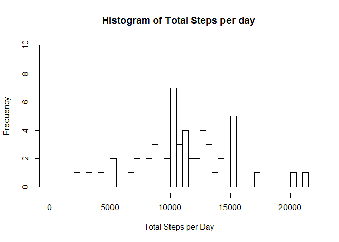
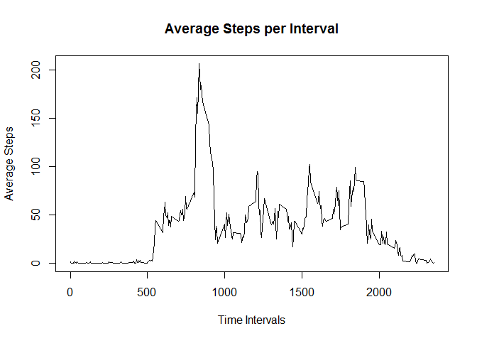

# Reproducible Research: Peer Assessment 1

## Loading and preprocessing the data

```r
library(plyr)
library(dplyr)
```


```r
idata <- read.csv("activity.csv", na.strings = "NA")
head(idata, 10)
```

```
##    steps       date interval
## 1     NA 2012-10-01        0
## 2     NA 2012-10-01        5
## 3     NA 2012-10-01       10
## 4     NA 2012-10-01       15
## 5     NA 2012-10-01       20
## 6     NA 2012-10-01       25
## 7     NA 2012-10-01       30
## 8     NA 2012-10-01       35
## 9     NA 2012-10-01       40
## 10    NA 2012-10-01       45
```
---

## What is mean total number of steps taken per day?


```r
daysdata <- group_by(idata, date)
sumdata1 <- summarise(daysdata, sum(steps, na.rm=TRUE))
colnames (sumdata1) <- c("date","Total")
hist(sumdata1$Total, breaks=60, main = "Histogram of Total Steps per day", xlab = "Total Steps per Day")
```

 


```r
MeanSteps <- mean(sumdata1$Total, na.rm=TRUE)
MedianSteps <- median(sumdata1$Total, na.rm=TRUE)
outdata <- paste("Mean Steps = ", MeanSteps, "  Median of Steps = ",MedianSteps)
outdata
```

```
## [1] "Mean Steps =  9354.22950819672   Median of Steps =  10395"
```


## What is the average daily activity pattern?


```r
intervaldata <- group_by(idata, interval)
sumdata1 <- summarise(intervaldata, mean(steps, na.rm=TRUE))
colnames (sumdata1) <- c("Interval","Average")

plot(sumdata1$Interval,sumdata1$Average, type = "l", xlab = "Time Intervals", ylab = "Average Steps", main = "Average Steps per Interval")
```

 


```r
MaxStepsInterval <- sumdata1$Interval[which.max(sumdata1$Average)]
MaxIntervalOutData <- paste("Maximum Average Steps Occurs at Time Interval ", MaxStepsInterval)
MaxIntervalOutData
```

```
## [1] "Maximum Average Steps Occurs at Time Interval  835"
```


## Imputing missing values


## Are there differences in activity patterns between weekdays and weekends?

