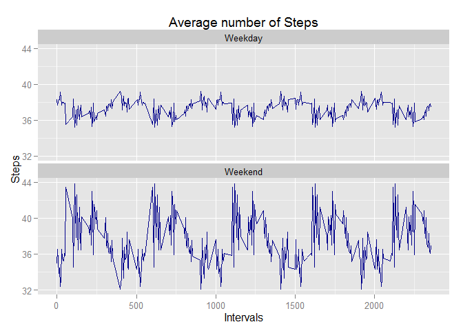

# Reproducible Research: Peer Assessment 1

## Loading and preprocessing the data
 The Activity data is loaded from the file to process.  And also the R Studio is configured to load the required R libraries.  

```r
library(plyr)
library(dplyr)
library(ggplot2)
library(data.table)
```

```
## Warning: package 'data.table' was built under R version 3.1.3
```
The head R function is used to show the nature of the observation in the Activity data set.

```r
OriginalData <- read.csv("activity.csv", na.strings = "NA")
head(OriginalData, 10)
```

```
##    steps       date interval
## 1     NA 2012-10-01        0
## 2     NA 2012-10-01        5
## 3     NA 2012-10-01       10
## 4     NA 2012-10-01       15
## 5     NA 2012-10-01       20
## 6     NA 2012-10-01       25
## 7     NA 2012-10-01       30
## 8     NA 2012-10-01       35
## 9     NA 2012-10-01       40
## 10    NA 2012-10-01       45
```
---

## What is mean total number of steps taken per day?
   Total number of steps taken per day is summarized here with the help of a histogram.  The data set is grouped based on date and summarized using the library functions from the dplyr library.  
   
   The histogram shows the total steps taken per day.  
   

```r
daysdata <- group_by(OriginalData, date)
sumdata1 <- summarise(daysdata, sum(steps, na.rm=TRUE))
colnames (sumdata1) <- c("date","Total")
hist(sumdata1$Total, breaks=60, main = "Histogram of Total Steps per day", xlab = "Total Steps per Day")
```

 

   The mean and meidan of the number of steps taken is calculated and displayed here.
   

```r
MeanSteps <- mean(sumdata1$Total, na.rm=TRUE)
MedianSteps <- median(sumdata1$Total, na.rm=TRUE)
OutMessage1 <- paste("Mean Steps = ", MeanSteps, "  Median of Steps = ",MedianSteps)
OutMessage1
```

```
## [1] "Mean Steps =  9354.22950819672   Median of Steps =  10395"
```


## What is the average daily activity pattern?
   The average daily steps is calculated here with the mean function and plotted a time series plot for the average daily steps.
   

```r
intervaldata <- group_by(OriginalData, interval)
sumdata2 <- summarise(intervaldata, mean(steps, na.rm=TRUE))
colnames (sumdata2) <- c("Interval","Average")

plot(sumdata2$Interval,sumdata2$Average, type = "l", xlab = "Time Intervals", ylab = "Average Steps", main = "Average Steps per Interval")
```

 

The maximum average steps occured in specific intervals as shown below.
   

```r
MaxStepsInterval <- sumdata2$Interval[which.max(sumdata2$Average)]
MaxIntervalOutMessage <- paste("Maximum Average Steps Occurs at Time Interval ", MaxStepsInterval)
MaxIntervalOutMessage
```

```
## [1] "Maximum Average Steps Occurs at Time Interval  835"
```


## Imputing missing values
   The original data has many observations missing and this is removed using the following strategy.  The imputing strategy used is to mutate the missing observation with the mean steps.
   

```r
NumberOfNA <- nrow(OriginalData[is.na(OriginalData$steps),])
NumberOfNAMessage <- paste(" The Number of rows with NAs are = ",NumberOfNA)
NumberOfNAMessage
```

```
## [1] " The Number of rows with NAs are =  2304"
```
   The original data set is grouped and summarized and replaced the missing observations with mean.
   

```r
daysdata2 <- group_by(OriginalData, date)
sumdata3 <- summarise(daysdata2, mean(steps, na.rm=TRUE))
colnames (sumdata3) <- c("date","MeanSteps")
NewImputedData <- OriginalData
sumdata3[,"MeanSteps"] <- round(sumdata3$MeanSteps)
NewImputedData[,"steps"] <- sumdata3$MeanSteps
```
   The following histogram shows the new imputed data set and from the observation the mean and median are closer now.
   

```r
daysdata5 <- group_by(NewImputedData, date)
sumdata5 <- summarise(daysdata5, sum(steps, na.rm=TRUE))
colnames (sumdata5) <- c("date","Total")
hist(sumdata5$Total, breaks=60, main = "Histogram of Total Steps per day with Imputed Data", xlab = "Total Steps per Day")
```

 


```r
MeanSteps2 <- mean(sumdata5$Total, na.rm=TRUE)
MedianSteps2 <- median(sumdata5$Total, na.rm=TRUE)
OutMessage3 <- paste("Mean Steps with Imputed Data = ", MeanSteps2, "  Median of Steps = ",MedianSteps2)
OutMessage3
```

```
## [1] "Mean Steps with Imputed Data =  9343.47540983607   Median of Steps =  9333"
```
## Are there differences in activity patterns between weekdays and weekends?
   The new imputed data set from the previous section is separated as weekends and weekdays using library functions.  Then the data is aggregated to find the new mean intervals and plotted using ggplot library function.

```r
NewImputedData$days <- as.factor(ifelse(weekdays(as.Date(NewImputedData$date)) %in% c("Saturday", "Sunday"), "Weekend", "Weekday"))
## Graph the panels for weekdays and weekends
stepsInXIntervals <- aggregate(steps ~ interval + days, data=NewImputedData, FUN=mean)
ggplot(stepsInXIntervals, aes(x=interval, y=steps)) +geom_line(colour="darkblue") + facet_wrap(~days, ncol=1) +labs(title="Average number of Steps", x="Intervals", y="Steps")
```

 

The observation from the plotted panel is that the weekend activity is more compared to weekday activities.

   
